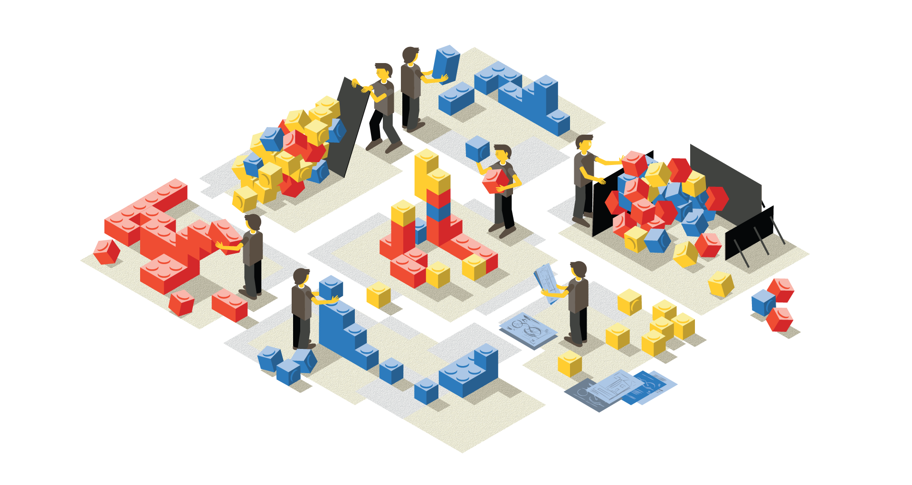

---

layout: default

---

# BEM

## **{{ site.presentation.title }}** {#cover}

    
{{ site.presentation.service }}





	
{{ site.author.name }},   {{ site.author.position }}

## **BEM is not just about CSS**

## **Interfaces are built with   blocks**

## ****
{:.cover}

## ****
{:.cover}

## ****
{:.cover}

## ****
{:.cover}

## **Blocks are made with   elements**

## ****
{:.cover}

## ****
{:.cover}

## ****
{:.cover}

## ****
{:.cover}

## ****
{:.cover}

## **Same blocks may behave differently with modifiers**

## ****
{:.cover}

## ****
{:.cover}

## ****
{:.cover}

## ****
{:.cover}

## Block Element Modifier

     

    <a style="color: #000; text-decoration: normal; top: -130px; display: inline-block; border: 0; background: 0; position: relative" href="https://en.bem.info/methodology/">bem.info</a>

## **CSS without conponent approach is pain**

## ****
{:.cover}

## **Blocks are independent and self-contained**

## ****
{:.cover}

## BEM on file system

~~~ python
blocks/
    button/
        button.css
        button.js
~~~

## BEM on file system

~~~ python
blocks/
    button/
        button.css
        button.js
        button.spec.js
~~~

## BEM on file system

~~~ python
blocks/
    button/
        button.css
        button.js
        button.spec.js
        button.md
~~~

## BEM tree

~~~ markup
<body class="page">
    <header class="header">
        
    </header>
    

    <aside class="sidebar"></aside>
    <footer class="footer">
        

    </footer>
</body>
~~~

<footer>
HTML maps to DOM tree
We need a way to describe interfaces in Blocks Elements and Modifiers
</footer>

## BEM tree

~~~ python
page
    header
        logo
    main
    sidebar
    footer
        copyright
~~~

## BEMJSON

~~~javascript
{
    block: 'page',
    title: 'Hello, BEM',
    content: [
        {
            block: 'header',
            content: { block: 'logo' }
        },
        { block: 'main' },
        { block: 'sidebar' },
        {
            block: 'footer',
            content: { block: 'copyright' }
        }
    ]
}
~~~

## Mixes: several entities on same node

~~~ markup
<nav class="nav">
    <a class="link nav__item" href="/">Main</a>
    <a class="link nav__item" href="/about/">About</a>
</nav>
~~~

## Mixes: several entities on same node

~~~ javascript
{
    block: 'nav',
    content: [
        {
            block: 'link',
            url: '/',
            mix: { block: 'nav', elem: 'item' },
            content: 'Main'
        },
        {
            block: 'link',
            url: '/about/',
            mix: { block: 'nav', elem: 'item' },
            content: 'About'
        }
    ]
}
~~~

## BEMHTML: BEMJSON to HTML
~~~ markup
<button class="button"></button>
~~~

## BEMHTML: BEMJSON to HTML
~~~ markup

    <button class="button"></button>

~~~

## BEMHTML: BEMJSON to HTML
~~~ markup
<button class="button"></button>
~~~

~~~css
.button {
    color: red;
}
~~~

## BEMHTML: BEMJSON to HTML
~~~ markup
<button class="button"></button>

    <button class="button"></button>

~~~

~~~css
.button {
    color: red;
}
~~~

## BEMHTML: BEMJSON to HTML

~~~javascript
{
    block: 'button'
}
~~~

~~~javascript
block('button')(
    tag()('button')
);
~~~

## BEMHTML: BEMJSON to HTML

~~~javascript
[
    {
        block: 'button'
    },
    {
        content: {
            block: 'button'
        }
    }
]
~~~

~~~javascript
block('button')(
    tag()('button')
);
~~~

## **[BEMHTML](https://bem.github.io/bem-xjst/)**

## BEM on file system

~~~python
blocks/
    button/
        button.css
        button.js
        button.spec.js
        button.md
~~~

## BEM on file system

~~~python
blocks/
    button/
        button.css
        button.js
        button.spec.js
        button.md
        button.bemhtml.js
~~~

## **Tune library on project side**

## Tune CSS

~~~python
library/
    button/
        button.css
~~~

## Tune CSS

~~~python
library/
    button/
        button.css

project/
    button/
        button.css
~~~

## Tune CSS

~~~python
library/
    button/
        button.css
            .button {
                width: 200px;
                color: green;
            }

project/
    button/
        button.css
~~~

## Tune CSS

~~~python
library/
    button/
        button.css
            .button {
                width: 200px;
                --color: green;--
            }

project/
    button/
        button.css
            .button {
                color: red;
            }
~~~

## Tune CSS

~~~python
library/
    button/
        button.css
            .button {
                width: 200px;
                --color: green;--
            }

project/
    button/
        button.css
            .button {
                color: red;
            }
~~~

~~~css
@import library/blocks/button/button.css;
@import project/blocks/button/button.css;
~~~

## Tune HTML
~~~python
library/
    button/
        button.bemhtml.js

project/
    button/
        button.bemhtml.js
~~~

## Tune HTML
~~~python
library/
    button/
        button.bemhtml.js
            block('button')(
                tag()('button'),
                attrs()({ 'area-role': 'button' })
            );

project/
    button/
        button.bemhtml.js
            block('button')(
                tag()('input')
            );
~~~

## Tune JavaScript
~~~ css
.button {
    border-radius: 5px;
}

.button_disabled {
    opacity: .5;
}
~~~

~~~markup
<button class="button"></button>
~~~

## Tune JavaScript
~~~ css
.button {
    border-radius: 5px;
}

.button_disabled {
    opacity: .5;
}
~~~

~~~markup
<button class="button button_disabled"></button>
~~~

## Tune JavaScript
~~~ javascript
BEMDOM.decl('button', {

});
~~~

## Tune JavaScript

~~~ javascript
BEMDOM.decl('button', {
    onSetMod: {

    }

});
~~~

## Tune JavaScript

~~~ javascript
BEMDOM.decl('button', {
    onSetMod: {
        disabled: {

        }
    }

});
~~~

## Tune JavaScript

~~~ javascript
BEMDOM.decl('button', {
    onSetMod: {
        disabled: {
            true: { this._onDisabled(); }

        }
    },
    _onDisabled: function() {}

});
~~~

## Tune JavaScript

~~~ javascript
BEMDOM.decl('button', {
    onSetMod: {
        disabled: {
            true: { this._onDisabled(); },
            '': { this._onEnabled(); }
        }
    },
    _onDisabled: function() {},
    _onEnabled: function() {}
});
~~~

<footer>
    Под декларативностью здесь я подразумеваю такой способ описания поведения блоков, когда вы, как в CSS, задаете правила, кторые должны примениться к блоку в момент появления модификатора или при его снятии (когда на DOM-узле появляется/исчезает новый класс — стили с селектором на него автоматически применяются браузером).
</footer>

## ****
{:.cover}

## **Ready-made UI libraries**

## ****
{:.cover}

## ****
{:.cover}

## **Component based testing**

## ****
{:.cover}

## ****
{:.cover}

## ****
{:.cover}

## ****
{:.cover}

## ****
{:.cover}

## **Let's take it all!**

## **[project-stub](https://github.com/bem/project-stub/)**

## **BEM is not just about CSS**

## **BEM is not just about CSS**

## BEM is not just about CSS

* Component approach to build interfaces
* ...Declarative JS
* ...Declarative templates
* ...Great libraries with ready-made blocks
* ...Sofisticated build system
* ...Tools to work with blocks on FS
* ...SDK to build your own tools
* ...and more

## **[bem.info](https://en.bem.info/)**

## ****
{:.cover}

## ****
{:.cover}

## **Questions time!**

## **Contacts** {#contacts}

{{ site.author.name }}

 
<!-- 
{{ site.author.position }}
 -->

    

        
bem.info

        
info@bem.info

        
bem_en&nbsp;&nbsp;&nbsp;&nbsp;#b_

        <!-- 
vk

        
facebook
 -->
    

    
<a href="http://tadatuta.github.io/frontend-united-talk-2016/">tadatuta.github.io/frontend-united-talk-2016</a>

